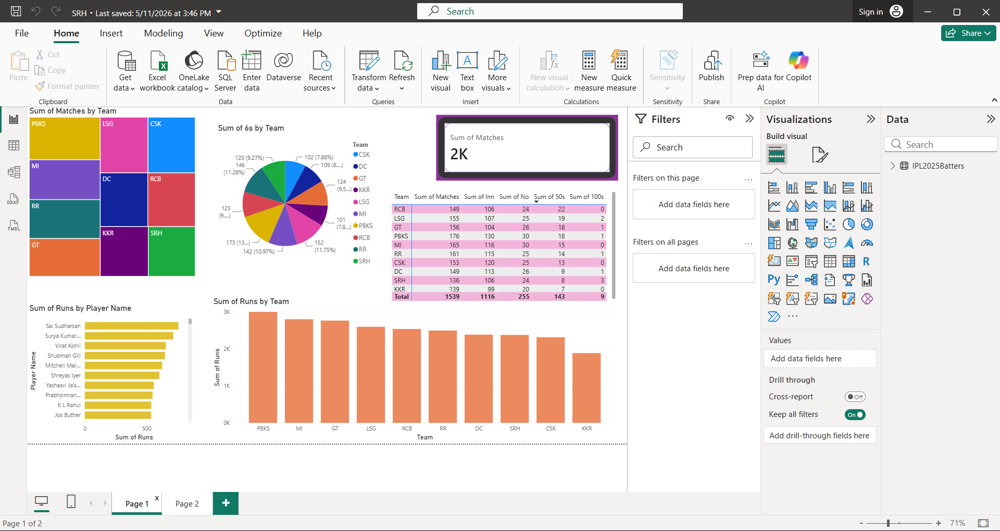

# 🏏 IPL 2025 Batting Performance Dashboard | Power BI Project

## 📌 Project Overview

This project presents an **Interactive IPL 2025 Batting Analysis Dashboard** built using **Microsoft Power BI** to analyze team and player performance across multiple batting metrics.

The dashboard provides insights into:

- Total Matches played by teams
- Team-wise Sixes Analysis
- Total Runs by Teams
- Player-wise Run Contributions
- Team Performance Comparison
- Batting Statistics Summary

This project demonstrates **Data Visualization, Business Intelligence, Data Cleaning, Data Modeling, and Dashboard Development** skills using Power BI.

---


### Dashboard Highlights

✔ Team-wise Match Analysis  
✔ Team-wise Sixes Distribution  
✔ Total Matches KPI Card  
✔ Team Statistical Summary  
✔ Runs by Team Visualization  
✔ Top Players Performance Analysis  

---


# 📷 Dashboard Preview

## IPL 2025 Batting Performance Dashboard

<p align="center">
  
</p>

# 🎯 Objective

The main objective of this project is to:

- Convert raw IPL batting data into meaningful insights.
- Analyze team performance.
- Identify top-performing players.
- Compare batting metrics across IPL teams.
- Build an interactive and professional dashboard.

---

# 🛠 Technologies Used

| Technology | Purpose |
|------------|---------|
| Power BI Desktop | Dashboard Development |
| Excel / CSV | Data Source |
| DAX | Calculated Measures |
| Power Query | Data Transformation |
| Data Modeling | Relationship Creation |

---

# 📂 Project Structure

```bash
IPL2025_Batting_Dashboard/
│
├── Dataset/
│   ├── IPL2025Batters.csv
│
├── Dashboard/
│   ├── IPL_Batting_Dashboard.pbix
│
├── Images/
│   ├── dashboard.png
│
├── README.md
│
└── Documentation/
    └── Project_Report.pdf
```

---

# 📊 Dashboard Components

## 1. Matches Played by Team (Treemap)

### Purpose:
Displays total matches played by each IPL team.

### Insights:
- Compare participation levels.
- Visual representation of team distribution.

---

## 2. Team-wise Sixes Distribution (Pie Chart)

### Purpose:
Displays number of sixes hit by each team.

### Insights:
- Analyze aggressive batting.
- Compare boundary scoring.

---

## 3. KPI Card – Total Matches

### Purpose:
Provides quick overview of total matches.

### Metric:

```text
Total Matches = 2K
```

---

## 4. Team Performance Table

### Metrics Included:

- Team
- Matches
- Innings
- Number of Outs
- Total 50s
- Total 100s

### Purpose:

Detailed statistical comparison across teams.

---

## 5. Runs by Player (Horizontal Bar Chart)

### Purpose:

Shows top run scorers.

### Example Players:

- Sai Sudharsan
- Suryakumar
- Virat Kohli
- Shubman Gill
- Mitchell Marsh
- KL Rahul

### Insights:

- Identify leading batters.
- Compare player consistency.

---

## 6. Runs by Team (Column Chart)

### Purpose:

Compare total runs scored by teams.

### Insights:

- Team scoring efficiency.
- Offensive team analysis.

---

# 🔄 Workflow

## Step 1: Data Collection

Collected IPL batting dataset containing:

- Player Name
- Team
- Runs
- Innings
- Matches
- Sixes
- Fifties
- Hundreds

---

## Step 2: Data Cleaning

Performed:

✔ Removed duplicates  
✔ Handled null values  
✔ Corrected data types  
✔ Standardized team names

Tools:
- Power Query Editor

---

## Step 3: Data Modeling

Created relationships between:

```text
Player Table
↓

Team Table
↓

Match Statistics
```

Optimized for performance and reporting.

---

## Step 4: DAX Calculations

Sample DAX Measures:

### Total Runs

```DAX
Total Runs =
SUM(IPL2025Batters[Runs])
```

---

### Total Matches

```DAX
Total Matches =
SUM(IPL2025Batters[Matches])
```

---

### Total Sixes

```DAX
Total Sixes =
SUM(IPL2025Batters[6s])
```

---

### Total Fifties

```DAX
Total 50s =
SUM(IPL2025Batters[50s])
```

---

### Total Hundreds

```DAX
Total 100s =
SUM(IPL2025Batters[100s])
```

---

# 📈 Key Insights

### Team Analysis

- PBKS recorded strong run contributions.
- MI maintained consistent batting performance.
- LSG demonstrated balanced statistics.

---

### Player Analysis

- Top players contributed significantly to team totals.
- Higher boundary count improved scoring efficiency.

---

### Performance Findings

- Teams with more sixes generally scored higher runs.
- Player consistency impacted overall results.

---

# 🚀 Features

✅ Interactive Dashboard  
✅ Team Comparison  
✅ Player Performance Analysis  
✅ Dynamic Filtering  
✅ KPI Cards  
✅ Professional Visualization  

---

# 📌 Future Improvements

- Add Bowling Dashboard
- Add Match Prediction Model
- Add Win Probability Analysis
- Deploy Dashboard Online
- Real-Time IPL Data Integration

---

# 📚 Learning Outcomes

Through this project, I learned:

- Power BI Dashboard Design
- DAX Functions
- Data Transformation
- KPI Development
- Business Intelligence Reporting
- Data Visualization Best Practices

---

# 👨‍💻 Author

**Rudra Ram**

Final Year B.Tech Student

### Connect With Me

LinkedIn:
[Add Your LinkedIn URL]

GitHub:
[Add Your GitHub URL]

---

# ⭐ If you found this project useful

Please give this repository a ⭐ on GitHub.

---

## Thank You
